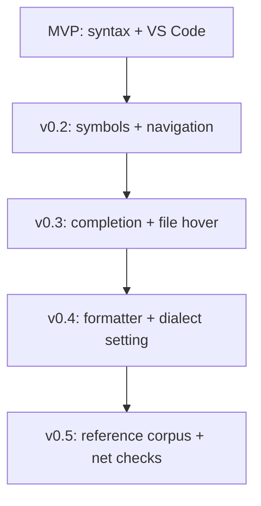

# Architecture

System layout for spice-lsp: crates, data flow, and how each release phase adds capability on top of the last.

## Story in four layers

Every feature belongs to one of these layers. MVP ships layer 1 only; later phases stack upward.

| Layer | Responsibility | Ships in |
|-------|----------------|----------|
| **1. Parse** | Tree-sitter CST, syntax diagnostics | MVP |
| **2. Index** | Symbols, scopes, cross-references | v0.2 |
| **3. Assist** | Completion, basic hover from the file | v0.3 |
| **4. Deep semantics** | Dialect reference docs, net connectivity, formatter | v0.4–v0.5 |

Layer 4 is documented in detail in [Dialect reference and net semantics](8_dialect-reference-and-semantics.md).

## High-level overview

```
┌─────────────────────────────────────────────────────────────────┐
│                        Editor clients                           │
│   VS Code extension  │  Neovim  │  Helix  │  other LSP clients  │
└────────────┬────────────────────────────────────────────────────┘
             │  JSON-RPC 2.0 over stdio (LSP)
             ▼
┌─────────────────────────────────────────────────────────────────┐
│  crates/spice-lsp          (binary: spice-lsp)                  │
│  ┌──────────────────────────────────────────────────────────┐   │
│  │ tower-lsp Backend                                        │   │
│  │  • text sync, publishDiagnostics                         │   │
│  │  • (v0.2) symbols, definition, references                │   │
│  │  • (v0.3) completion, hover (file-local)                 │   │
│  │  • (v0.4) formatting                                     │   │
│  │  • (v0.5) hover from reference corpus                    │   │
│  └────────────────────────┬─────────────────────────────────┘   │
└───────────────────────────┼─────────────────────────────────────┘
                            │
          ┌─────────────────┼─────────────────┐
          ▼                 ▼                 ▼
┌─────────────────┐ ┌───────────────┐ ┌──────────────────┐
│ spice-parser    │ │ spice-reference│ │ tree-sitter-spice│
│ parse, index,   │ │ dialect docs   │ │ grammar, queries │
│ diagnose, format│ │ (v0.5)         │ │                  │
└─────────────────┘ └───────────────┘ └──────────────────┘
```

## Crate responsibilities

| Crate / directory | Role | First shipped |
|-------------------|------|---------------|
| `crates/spice-lsp` | LSP server, JSON-RPC, document store | MVP |
| `crates/spice-parser` | Parsing, symbol index, diagnostics, format | MVP (parse only) |
| `crates/spice-reference` | Load and query dialect reference entries | v0.3 |
| `tree-sitter-spice/` | Grammar and query files | MVP |
| `reference/` | Curated JSON (or YAML) per dialect — **authored over time** | v0.5 |
| `editors/vscode/` | VS Code extension client | MVP |
| `test-data/` | Fixtures for syntax, semantics, hover snapshots | MVP |

## LSP server lifecycle

1. **Client connects** via stdio; sends `initialize` with client capabilities and dialect option.
2. **Server responds** with capabilities for the current phase (MVP: incremental sync only).
3. **Document open/change** updates an in-memory map of open buffers.
4. **On each change** (debounced ~150 ms):
   - Re-parse with Tree-sitter
   - Run diagnostic passes for the enabled phase
   - Send `textDocument/publishDiagnostics` with the document version
5. **Hover / completion requests** (v0.3+) resolve against the CST; v0.5+ also queries `spice-reference`. Navigation requests re-analyze on demand so the symbol index stays current even when diagnostics are still debouncing.
6. **Shutdown** exits cleanly.

### Document model

```rust
struct Document {
    uri: Url,
    text: String,
    tree: tree_sitter::Tree,
    version: i32,
    // v0.2+
    symbols: SymbolTable,
    // v0.5+
    net_graph: Option<NetGraph>,
}
```

## Parser and analysis pipeline

### Phase 1 — Syntax (MVP)

1. Parse buffer → CST
2. Collect ERROR / MISSING nodes and hand-written checks (e.g. unclosed `.subckt`)
3. Map to LSP `Diagnostic` (Error)

### Phase 2 — Symbol index (v0.2)

Walk the CST to build:

- Subcircuit and model definitions
- Component instances and `.param` bindings

Enables navigation, duplicate-name warnings, and undefined reference checks.

### Phase 3 — Assist (v0.3)

Use the symbol index for completion and **file-local hover** (subcircuit pin lists, `.model` parameters defined in the same buffer).

### Phase 4 — Format and dialect (v0.4)

Formatter engine reads CST → `TextEdit` list. Dialect setting selects grammar quirks and reference namespace.

### Phase 5 — Reference docs and connectivity (v0.5)

Two parallel analyzers — see [Dialect reference and net semantics](8_dialect-reference-and-semantics.md):

**Reference lookup:** Map cursor token → `reference/<dialect>/…` entry → markdown hover.

**Net graph:** Build terminal graph per scope → warn on dangling nodes and floating nets.

```
Instance lines ──► NetGraph ──► dangling / floating diagnostics
Cursor token   ──► ReferenceIndex ──► rich hover markdown
```

## Phased rollout



| Phase | User-visible outcome |
|-------|----------------------|
| **MVP** | Syntax error squiggles in VS Code |
| v0.2 | Outline, go to definition, duplicate / undefined symbol warnings |
| v0.3 | Element and directive completion; hover on subcircuits and models in file |
| v0.4 | Format document; choose Ngspice / LTspice / HSPICE |
| **v0.5** | Hover docs for directives and options from curated reference; warnings on dangling nodes and floating nets |

## VS Code extension

Thin Node client: spawns `spice-lsp`, forwards LSP traffic, exposes dialect and diagnostic settings. No parsing in TypeScript.

See [VS Code integration](development/4_vscode-integration.md).

## Performance targets

| Metric | Target |
|--------|--------|
| Parse + syntax diagnose (5k lines) | < 50 ms |
| Full semantic pass + net graph (50k lines) | < 100 ms |
| Reference hover lookup | < 1 ms (in-memory index) |
| Incremental edit | Re-parse changed regions only |

## Related reading

- [Dialect reference and net semantics](8_dialect-reference-and-semantics.md) — v0.5 deep dive
- [LSP features](5_lsp-features.md) — method-by-method status
- [MVP guide](development/2_mvp.md) — implementation order for layer 1
- [Design (internal)](internal/1_design.md) — full requirements
