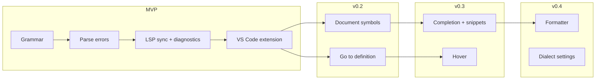

# Architecture

System layout for spice-lsp: crates, data flow, and how MVP differs from the full design.

## High-level overview

```
┌─────────────────────────────────────────────────────────────────┐
│                        Editor clients                           │
│   VS Code extension  │  Neovim  │  Helix  │  other LSP clients  │
└────────────┬────────────────────────────────────────────────────┘
             │  JSON-RPC 2.0 over stdio (LSP)
             ▼
┌─────────────────────────────────────────────────────────────────┐
│  crates/spice-lsp          (binary: spice-lsp)                  │
│  ┌──────────────────────────────────────────────────────────┐   │
│  │ tower-lsp Backend                                        │   │
│  │  • initialize / shutdown                                 │   │
│  │  • textDocument sync                                     │   │
│  │  • publishDiagnostics                                    │   │
│  │  • (later) completion, hover, definition, formatting     │   │
│  └────────────────────────┬─────────────────────────────────┘   │
└───────────────────────────┼─────────────────────────────────────┘
                            │
                            ▼
┌─────────────────────────────────────────────────────────────────┐
│  crates/spice-parser       (library)                            │
│  ┌─────────────┐  ┌──────────────────┐  ┌─────────────────┐   │
│  │ Tree-sitter │→ │ DocumentSnapshot │→ │ DiagnosticEngine│   │
│  │   grammar   │  │  (per URI/buffer)│  │  syntax + sem   │   │
│  └─────────────┘  └──────────────────┘  └─────────────────┘   │
│                            │                                    │
│                            ▼ (post-MVP)                         │
│                   ┌─────────────────┐                           │
│                   │ FormatterEngine │                           │
│                   └─────────────────┘                           │
└─────────────────────────────────────────────────────────────────┘
                            ▲
                            │
                   tree-sitter-spice/
                   (grammar.js, queries/, bindings)
```

## Crate responsibilities

| Crate / directory | Role | MVP? |
|-------------------|------|------|
| `crates/spice-lsp` | LSP server binary, JSON-RPC, document store | Yes |
| `crates/spice-parser` | Parsing, snapshots, diagnostics (and later format) | Yes |
| `tree-sitter-spice/` | Grammar, highlight/query `.scm` files | Yes |
| `editors/vscode/` | VS Code extension (TypeScript client) | Yes |
| `test-data/` | Fixture netlists for tests and demos | Yes |

## LSP server internals

The server follows the standard tower-lsp pattern:

1. **Client connects** via stdio; sends `initialize` with client capabilities.
2. **Server responds** with capabilities (MVP: `textDocumentSync`: incremental, `publishDiagnostics` implicit).
3. **Document open/change** events update an in-memory `HashMap<Url, Document>`.
4. **On each change** (debounced ~50–100 ms post-MVP; synchronous for MVP is fine on small files):
   - Re-parse buffer with Tree-sitter
   - Run diagnostic pass
   - Send `textDocument/publishDiagnostics`
5. **Shutdown** flushes state and exits cleanly.

### Document model

```rust
// Conceptual — actual types live in spice-parser
struct Document {
    uri: Url,
    text: String,
    tree: tree_sitter::Tree,
    version: i32,
}
```

Tree-sitter supports incremental re-parse: pass the previous tree and edit ranges for low latency on large files.

## Parser pipeline

### Phase 1 (MVP): syntax only

1. Load SPICE source into a Tree-sitter parser
2. Collect **ERROR** and **MISSING** nodes from the CST
3. Map node byte ranges to LSP `Range` (UTF-16 code units per LSP spec)
4. Emit `Diagnostic` with severity `Error` or `Warning`

### Phase 2: light semantics

Walk the CST to build indexes:

- Subcircuit definitions (`.subckt` / `.ends`)
- Model definitions (`.model`)
- Component instances (R, C, L, M, …)

Use indexes for:

- Duplicate instance name detection
- Unknown model/subcircuit references
- Go to definition / find references

### Phase 3: formatter

Read CST → compute column boundaries → emit `TextEdit` list. Kept separate from diagnostics so formatting can be optional and testable in isolation.

## Phased rollout



| Phase | User-visible outcome |
|-------|----------------------|
| **MVP** | Red squiggles on syntax errors in VS Code |
| v0.2 | Outline panel, jump to `.subckt` / `.model` |
| v0.3 | Autocomplete element lines, directive snippets |
| v0.4 | Format document, dialect-specific parsing options |

## Key dependencies

| Crate | Use |
|-------|-----|
| `tower-lsp`, `tower-lsp-macros` | LSP server framework |
| `tokio` | Async runtime for tower-lsp |
| `tree-sitter` | Incremental parser driver |
| `serde`, `serde_json` | LSP message (de)serialization |
| `url` | Document URIs |
| `clap` | CLI flags (`--version`, future `--stdio` vs debug logging) |

Tree-sitter grammar lives in-repo under `tree-sitter-spice/` and is compiled into `spice-parser` via `build.rs`.

## VS Code extension architecture

The extension is a **thin client**:

```
Extension Host (Node)
  └── extension.ts
        ├── LanguageClient spawns: spice-lsp (absolute path or PATH)
        ├── Document selector: [{ language: 'spice', scheme: 'file' }]
        └── (optional) status bar, restart command
```

No parsing in TypeScript — all language intelligence stays in Rust for consistency across editors.

See [VS Code integration](development/4_vscode-integration.md).

## Performance targets

| Metric | Target |
|--------|--------|
| Parse + diagnose (5k lines) | < 50 ms |
| Parse + diagnose (50k lines) | < 100 ms |
| Incremental edit | Re-parse changed regions only |
| Memory | One CST per open document |

Measure with `criterion` benchmarks in `spice-parser` once the grammar exists.

## Related reading

- [Design document (internal)](internal/1_design.md) — full capability spec
- [LSP features](5_lsp-features.md) — method-by-method status
- [MVP guide](development/2_mvp.md) — implementation order
